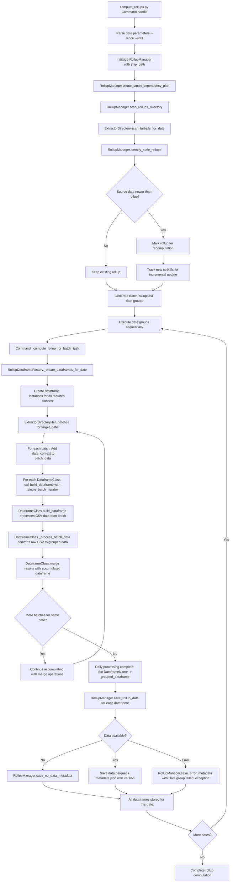
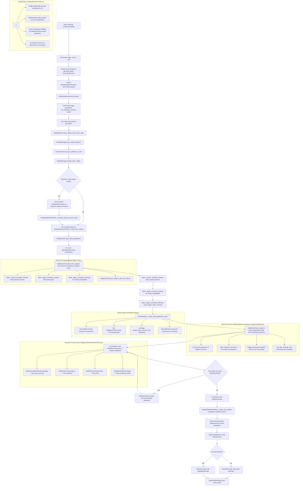

# Rollups System

The Rollups system provides pre-computed daily aggregations of metrics data stored as parquet files, enabling faster report generation by avoiding the need to reprocess raw data for each report request.

## Quick Start

### Basic Usage

**1. Compute rollups for a date range**:
```bash
# In Docker environment (recommended)
docker compose -f tools/docker/docker-compose.yaml exec metrics-utility-env uv run python manage.py compute_rollups --since=2025-07-08 --until=2025-07-11 --force

# Or locally with environment variables set
python manage.py compute_rollups --since=2025-07-08 --until=2025-07-11 --force
```

**2. Generate reports using rollups**:
```bash
# Reports automatically use rollups when available, and compute missing ones as needed
docker compose -f tools/docker/docker-compose.yaml exec metrics-utility-env uv run python manage.py build_report --since=2025-07-08 --until=2025-07-11 --force
```

---

## Overview

The rollup system consists of two main phases:

1. **Rollup Computation**: Daily processing that generates and stores aggregated dataframes as parquet files
2. **Report Generation**: Loading pre-computed parquet files to generate reports quickly

## Architecture

### Directory Structure

```
SHIP_PATH/
├── data/                                    # Raw input data (tarballs)
│   └── YYYY/
│       └── MM/
│           └── DD/
│               └── *.tar.gz
├── rollups/                                 # Pre-computed rollup data
│   └── daily/
│       └── YYYY/
│           └── MM/
│               └── DD/
│                   ├── DataframeJobhostSummaryUsage/
│                   │   ├── 20250821_160000_123456_v1.0/
│                   │   │   ├── data.parquet
│                   │   │   └── metadata.json
│                   │   ├── 20250821_170000_654321_v1.0/
│                   │   │   ├── data.parquet
│                   │   │   └── metadata.json
│                   │   ├── 20250821_180000_789012_v1.0__status__error/
│                   │   │   └── metadata.json    # Error status (no data.parquet)
│                   │   └── 20250821_190000_567890_v1.0__status__no_data/
│                   │       └── metadata.json    # No data status (no data.parquet)
│                   ├── DataframeContentUsage/
│                   │   └── 20250821_160000_234567_v1.0/
│                   │       ├── data.parquet
│                   │       └── metadata.json
│                   ├── DataframeInventoryScope/
│                   │   └── 20250821_160000_345678_v1.0/
│                   │       ├── data.parquet
│                   │       └── metadata.json
│                   └── DataframeCollectionStatus/ (CCSPv2 only)
│                       └── 20250821_160000_456789_v1.0__status__no_data/
│                           └── metadata.json    # Often has no data for many dates
└── reports/                                 # Generated XLSX reports
    └── YYYY/
        └── MM/
            └── ReportType-YYYY-MM-DD--YYYY-MM-DD.xlsx
```

### Metadata Schema

Each version directory contains a `metadata.json` file that tracks computation metadata:

```json
{
  "computation_timestamp": "2025-08-21T16:00:00.123456Z",
  "processing_status": "complete",
  "dataframe_name": "DataframeJobhostSummaryUsage",
  "since_date": "2025-03-01",
  "until_date": "2025-03-01", 
  "records_processed": 1250,
  "processing_time_seconds": 15.7,
  "version": "20250821_160000_123456_v1.0",
  "error_message": null
}
```

#### Versioning System

Versions are identified by timestamp with microsecond precision to prevent conflicts:

- **Data versions**: `YYYYMMDD_HHMMSS_FFFFFF_v1.0`
- **Error versions**: `YYYYMMDD_HHMMSS_FFFFFF_v1.0__status__error` (processing failed)
- **No source data versions**: `YYYYMMDD_HHMMSS_FFFFFF_v1.0__status__no_source_data` (no tarballs found)
- **No data versions**: `YYYYMMDD_HHMMSS_FFFFFF_v1.0__status__no_data` (tarballs found but empty data)
- **Automatic latest detection**: System finds the latest valid version by timestamp sorting
- **Status-aware loading**: Skips status versions (`__status__*`) when loading actual data

#### Status Version Behavior

- **Data versions**: Contain `data.parquet` + `metadata.json` files with actual metrics data
- **Status versions**: Contain only `metadata.json` with processing status information:
  - `__status__no_source_data`: No tarballs found for this date/dataframe combination
  - `__status__no_data`: Tarballs existed but contained no data after processing
  - `__status__error`: Exception occurred during dataframe computation or parquet storage
- **No duplicate versions**: Fixed logic ensures only one version per computation (either data or status)
- **Smart loading**: Reports automatically merge only available data versions, skipping status versions
- **Graceful degradation**: Reports generate with partial data when some dates have no source data

## Unified Data Loading Architecture (Phase 1 Complete)

### Overview

The unified data loading architecture eliminates the 5x redundant I/O problem by reading each tarball exactly once and distributing data to all dataframe builders simultaneously. This represents a major architectural improvement that provides immediate performance benefits while maintaining code consistency.

### Key Architecture Components

**Core Factory Classes:**
- `RollupDataframeFactory` - Main factory for unified data loading and rollup creation
- `RollupManager` - Handles rollup storage, versioning, and metadata tracking
- `RollupReader` - Loads and merges rollup dataframes with schema consistency

**Dataframe Classes with Unified Interface:**
- `DataframeJobhostSummaryUsage` - Managed nodes processing (handles both job_host_summary and indirect_nodes)
- `DataframeContentUsage` - Content usage processing (main_jobevent)
- `DataframeInventoryScope` - Inventory scope processing (main_host)
- `DataframeCollectionStatus` - Collection status processing (data_collection_status)

**Base Class Features:**
- `Base.load_from_parquet()` - Schema-consistent parquet loading
- `Base.merge()` - Dataframe merging with mixed type comparison protection
- `Base.summarize_merged_dataframes()` - Safe aggregation operations with error handling

## Rollup Computation Flow with Unified Architecture



## Report Generation from Rollups with Unified Architecture



## Dataframe Mappings

The rollup system stores aggregated dataframes that directly correspond to report sections:

| Dataframe Class | Parquet File | Report Sections | Key Columns |
|-----------------|--------------|-----------------|-------------|
| `DataframeJobhostSummaryUsage` | `DataframeJobhostSummaryUsage.parquet` | Managed Nodes | `host_name`, `organization_name`, `task_runs`, `host_runs`, `first_automation`, `last_automation` |
| `DataframeContentUsage` | `DataframeContentUsage.parquet` | Usage by Collections/Roles/Modules | `host_name`, `collection_name`, `role_name`, `module_name`, `task_runs`, `duration` |
| `DataframeInventoryScope` | `DataframeInventoryScope.parquet` | Inventory Scope | `host_name`, `organizations`, `inventories`, `canonical_facts`, `facts` |
| `DataframeCollectionStatus` | `DataframeCollectionStatus.parquet` | Data Collection Status (CCSPv2) | `cluster_id`, `reporting_date`, `collection_status`, `data_quality_score` |

## Key Architecture Classes and Methods

**RollupDataframeFactory (Main Factory):**
- `RollupDataframeFactory.create()` - Main entry point for dataframe creation
- `RollupDataframeFactory._create_dataframes_for_date()` - Unified data loading for single date
- `RollupDataframeFactory._create_from_rollups()` - Load from existing rollups with schema consistency
- `RollupDataframeFactory._get_table_to_class_mapping()` - Maps CSV table names to dataframe classes
- `RollupDataframeFactory._get_rollup_to_standard_mapping()` - Maps class names to standard report names

**Dataframe Classes (Unified Interface):**
- `DataframeJobhostSummaryUsage.build_dataframe(batch_data_iterator)` - Process job_host_summary and indirect_nodes
- `DataframeContentUsage.build_dataframe(batch_data_iterator)` - Process main_jobevent data
- `DataframeInventoryScope.build_dataframe(batch_data_iterator)` - Process main_host data
- `DataframeCollectionStatus.build_dataframe(batch_data_iterator)` - Process data_collection_status data

**Base Class Features:**
- `Base.load_from_parquet(parquet_path)` - Schema-consistent parquet loading
- `Base.merge(rollup, new_group)` - Safe dataframe merging with error handling
- `Base.summarize_merged_dataframes()` - Protected min/max operations with mixed type handling
- `Base._ensure_complete_schema()` - Add missing columns with proper defaults
- `Base._apply_consistent_casting()` - Type consistency for merge compatibility
- `Base._apply_consistent_indexing()` - Index alignment using unique_index_columns

**RollupReader (Rollup Loading):**
- `RollupReader.load_rollup_dataframes()` - Load and merge rollups with schema consistency
- `RollupReader._merge_using_dataframe_class()` - Use dataframe class merge operations
- `RollupReader.check_rollups_with_source_data()` - Smart dependency checking with source data scanning

**RollupManager (Storage & Versioning):**
- `RollupManager.save_rollup_data()` - Store successful rollup with data.parquet
- `RollupManager.save_no_data_metadata()` - Store no-data status with metadata only
- `RollupManager.save_error_metadata()` - Store error status with exception details
- `RollupManager.create_smart_dependency_plan()` - Incremental update planning

## Error Handling and Data Quality

### Mixed Type Comparison Protection

The system includes comprehensive protection against mixed type comparison errors that can occur when processing real-world data:

```python
# In Base.summarize_merged_dataframes()
try:
    df[col] = df[[col_x, col_y]].min(axis=1, skipna=True)
except TypeError as e:
    if 'not supported between instances' in str(e):
        logger.warning(f'Mixed type comparison detected for column {col} during min operation: {e}. Using safe comparison fallback.')
        # Use safe_min function with proper NaN and type handling
        df[col] = df.apply(safe_min, axis=1)
```

**Common Protected Operations:**
- `first_automation` min operations - handles float NaN vs Timestamp comparisons
- `last_automation` max operations - handles float NaN vs Timestamp comparisons  
- `job_created` max operations - handles float NaN vs Timestamp comparisons

**Error Logging:**
```
Mixed type comparison detected for column first_automation during min operation: '<=' not supported between instances of 'float' and 'Timestamp'. Using safe comparison fallback.
```

### Robust Error Handling

**Date Group Processing:**
- Individual date group failures don't stop overall computation
- Error metadata saved with detailed exception information
- Processing continues with partial data for successful dates

**Status Tracking:**
- `__status__error` - Processing failed with detailed error message
- `__status__no_data` - Processing succeeded but no data available
- `__status__no_source_data` - No source tarballs found for date

**Graceful Degradation:**
- Reports generate with available data when some dates fail
- Clear warnings about missing data in report output
- No duplicate version creation prevents storage conflicts

## Usage Commands

### Computing Rollups

```bash
# Compute rollups for a single date
python manage.py compute_rollups --since=2025-03-01

# Compute rollups for a date range  
python manage.py compute_rollups --since=2025-03-01 --until=2025-03-31

# Force recomputation of existing rollups
python manage.py compute_rollups --since=2025-03-01 --force

# Show parallel execution plan without executing
python manage.py compute_rollups --since=2025-03-01 --until=2025-03-07 --parallel

# List available rollups with versions
python manage.py compute_rollups --list

# Clean invalid rollups
python manage.py compute_rollups --since=2025-03-01 --until=2025-03-31 --clean
```

### Generating Reports from Rollups

```bash
# Generate report using rollups (auto-computes missing/stale rollups first - DEFAULT)
python manage.py build_report --since=2025-03-01 --until=2025-03-31

# Generate monthly report using rollups with validation
python manage.py build_report --month=2025-03

# Force report generation with fresh rollup computation
python manage.py build_report --month=2025-03 --force
```

## Performance Benefits

Rollups provide significant performance improvements by pre-computing daily aggregations:

- **5x I/O Reduction**: Unified data loading reads each tarball exactly once instead of 5 times
- **Faster report generation**: Reports load pre-aggregated parquet files instead of processing raw CSV data
- **Memory Efficiency**: Single-pass processing with shared batch iterators
- **Reduced CPU usage**: Pre-computed aggregations eliminate repeated calculations
- **Schema Consistency**: Unified parquet loading ensures compatible dataframes for merging
- **Mixed Type Protection**: Safe comparison operations prevent processing failures

## Rollup Management

### Smart Computation
- **Batch Processing**: Computes all dataframes for each date together using shared data loading
- **Incremental Updates**: Only computes missing or stale rollups based on source data timestamps
- **Source Data Scanning**: Automatically detects new tarballs and marks rollups for recomputation
- **Dependency Resolution**: Smart planning identifies exactly which dates and dataframes need computation
- **Version Management**: Conflict-free versioning with microsecond timestamp precision

### Status System and Error Handling
- **Data versions**: Successful computation with `data.parquet` files containing actual metrics
- **No source data versions**: `__status__no_source_data` for dates with no tarballs available
- **No data versions**: `__status__no_data` for dates with tarballs but empty processed data
- **Error versions**: `__status__error` for failed computations with detailed error messages
- **Mixed Type Protection**: Automatic handling of float vs Timestamp comparison errors with warning logs
- **Graceful Recovery**: Processing continues with partial data when individual dates fail
- **Smart Loading**: Reports automatically skip status versions and merge only valid data

### Storage Optimization
- **Parquet Format**: Efficient compression and fast loading with 60-80% size reduction vs CSV
- **Columnar Storage**: Supports predicate pushdown for efficient filtering
- **Native Types**: Optimal storage for sets, lists, and JSON data structures
- **Schema Evolution**: Versioned storage allows schema changes without data loss
- **Conflict Prevention**: Microsecond timestamps prevent version conflicts during rapid computation

## Integration with Existing System

The rollup system integrates seamlessly with the existing codebase:

1. **No breaking changes**: Report generation commands remain unchanged
2. **Automatic rollup computation**: Missing rollups are computed on-demand during report generation
3. **Unified Architecture**: Same dataframe merge logic used for both live data and rollup data
4. **Transparent Operation**: System automatically manages rollup computation, versioning, and loading
5. **Robust Error Handling**: Mixed type comparison protection ensures processing reliability
6. **Performance Monitoring**: Comprehensive OpenTelemetry tracing for observability

## Configuration

Rollups are controlled by the same environment variables as standard report generation:

```bash
# Required
METRICS_UTILITY_SHIP_PATH=./data
METRICS_UTILITY_SHIP_TARGET=directory  
METRICS_UTILITY_REPORT_TYPE=CCSPv2

# Optional
METRICS_UTILITY_DEDUPLICATOR=ccsp-experimental
METRICS_UTILITY_ORGANIZATION_FILTER=org1;org2
```

## Monitoring and Troubleshooting

### Check Rollup Status
```bash
# List all available rollups with status
python manage.py compute_rollups --list
```

### Validate Rollup Integrity
```bash
# Clean corrupted rollups for a date range
python manage.py compute_rollups --since=2025-03-01 --until=2025-03-31 --clean
```

### Debug Rollup Issues
1. **Check Error Logs**: Look for mixed type comparison warnings and date group failures
2. **Validate Metadata**: Review `metadata.json` files in error versions for detailed error messages
3. **Verify Source Data**: Ensure tarballs exist and are readable for the date range
4. **Monitor Performance**: Use OpenTelemetry traces to identify bottlenecks
5. **Check Data Quality**: Review warning logs for mixed type comparisons in datetime columns

### Common Error Patterns

**Mixed Type Comparison Errors:**
```
Mixed type comparison detected for column first_automation during min operation: '<=' not supported between instances of 'float' and 'Timestamp'. Using safe comparison fallback.
```
- **Cause**: Generated or corrupted data with mixed float NaN and Timestamp values
- **Resolution**: System automatically uses safe comparison fallback with warning log
- **Action**: Review data quality and generation processes

**Date Group Failures:**
```
Date group failed: Cannot convert non-finite values (NA or inf) to integer
```
- **Cause**: Invalid data values during casting operations
- **Resolution**: System saves error metadata and continues with other dates
- **Action**: Examine source data for the failing date

## OpenTelemetry Tracing

The rollup system includes comprehensive OpenTelemetry tracing for performance monitoring and debugging:

**Key Trace Operations**:
- `rollup.computation` - Overall rollup command execution with smart dependency planning
- `rollup.task.execution` - Individual rollup task processing per date with batch optimization
- `rollup.dataframe.processing` - Unified data loading and dataframe creation
- `rollup.parquet.save` - Parquet file writing with versioning and metadata
- `report.build` - Report generation using pre-computed rollups
- `report.rollup.loading` - Loading and merging rollup dataframes with schema consistency

**Performance Metrics**:
- I/O reduction tracking (5x improvement with unified loading)
- Memory usage optimization with shared batch iterators
- Processing time per date and dataframe
- Mixed type comparison frequency and impact

**Enable Tracing**:
```bash
export OTEL_TRACES_ENABLED=true
export OTEL_SERVICE_NAME=metrics-utility
# Use with observability stack from MONITORING.md
docker compose -f tools/docker/docker-compose.yaml --profile=otel up -d
```

## Future Enhancements

- **Distributed Processing**: Process date groups in parallel across multiple workers
- **Hierarchical Rollups**: Create weekly/monthly rollups from daily rollups for faster long-term reporting
- **Advanced Caching**: Intelligent caching strategies for frequently accessed rollup combinations
- **Data Quality Monitoring**: Enhanced tracking and alerting for mixed type comparisons and data quality issues